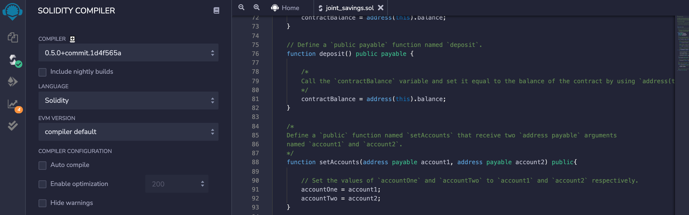
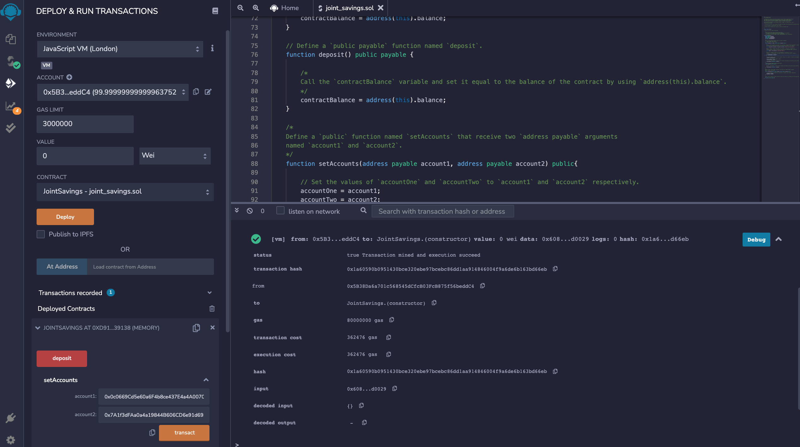
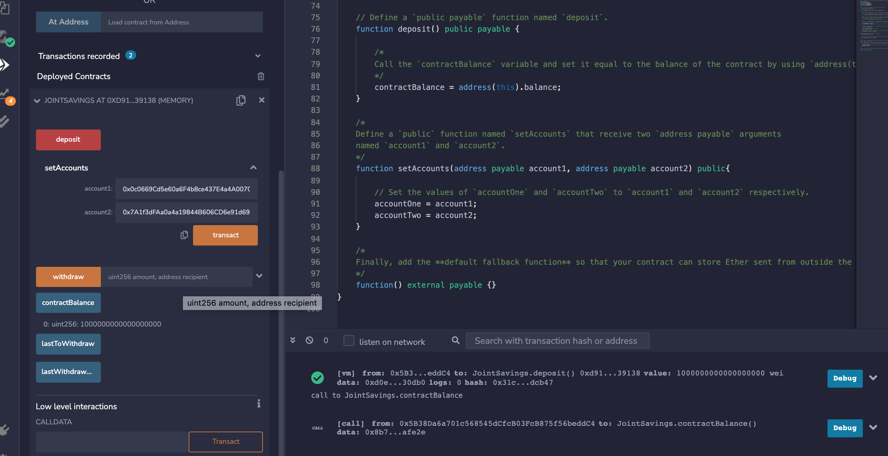
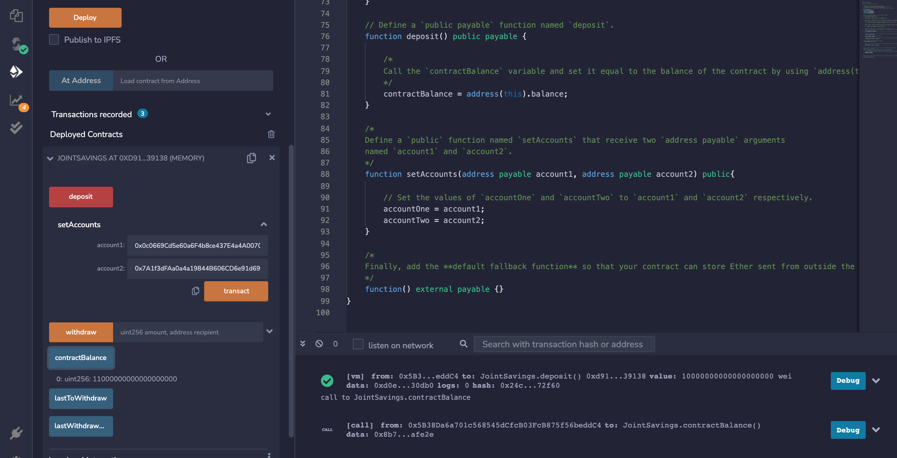
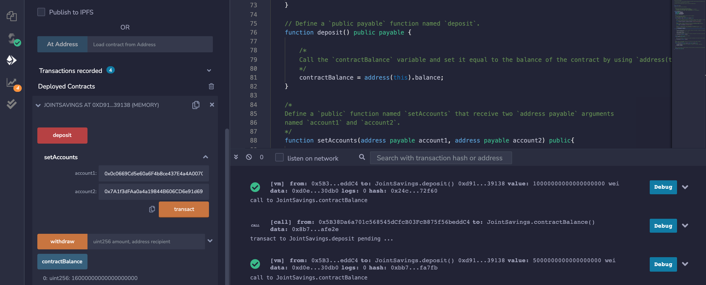
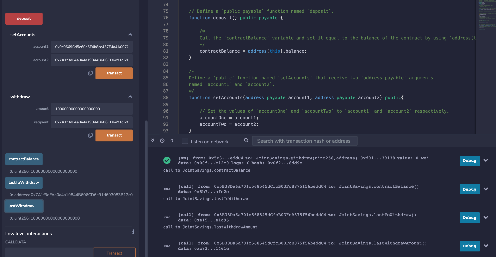

# **Smart_Contract_Solidity**

This purpose of this project is to automate the creation of joint savings accounts by  creating a Solidity smart contract that accepts two user addresses. These addresses will be able to control a joint savings account. The smart contract will use ether/wei management functions to implement a financial institution’s requirements for providing the features of the joint savings account. These features will consist of the ability to deposit and withdraw funds from the account.

---

## **Technologies**

This program is written in Solidity using Remix IDE.  

To run this you will need to open the joint_accounts.sol file in Remix.etherium.org which will lead to a Remix IDE screen.  

You can open the joint_accounts.sol file in that system to make deposits and withdrawls.

1. Compiled and Deployed Smart Contract

2. Setting Up Two Accounts

3. Depositing 1 Ether as Wei

4. Depositing 10 Ether as Wei

5. Depositing 5 Ether

6. Withdrawing 5 Ether into Account 1

7. Withdrawing 10 Ether into Account 2

---

## **Contributors**

The author of this application is Kanika Sharma with Github username kinsnik, who also goes by Niki. She can be reached at ksharmaconnect3@gmail.com or on LinkedIn under Kanika Sharma: https://www.linkedin.com/in/kanika-sharma-aa28a6134/.

---

## **License**

Users have permissions to read this file, but not write or edit the code. The code within, if used, should be properly recognized and cited as the intellectual property of the author. 
